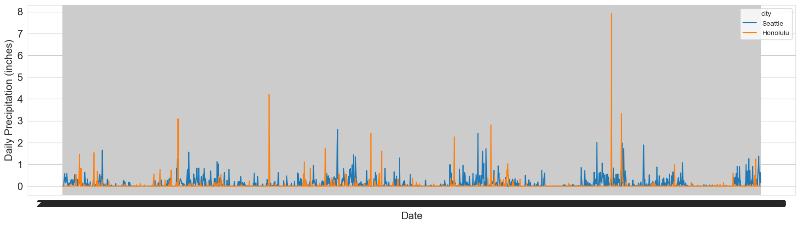
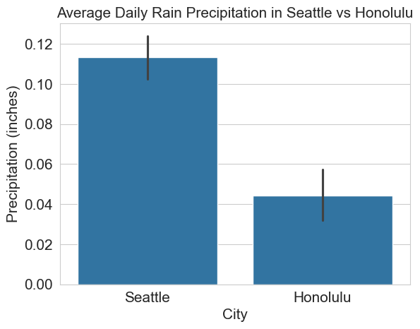
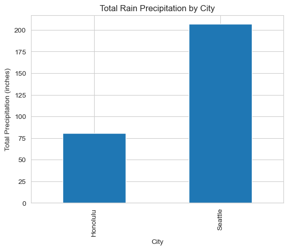

# Seattle and Honolulu Rain Precipitation Report. Does Honolulu get more rain than Seattle?

## Introduction
This report analyzes daily rain precipitation between Seattle and Honolulu in 2018 - 2022. It will compare average monthly rain precipitation between the two cities and determine if Honolulu gets more rain than Seattle. The report would initially compare total daily rain precipitation between the two cities and then analyze how it varies on a monthly basis evaluating seasonal trends, and variability.

## Rain Precipitation Analysis

The analysis focuses on comparing the average monthly rain precipitation (in inches) between Seattle and Honolulu from 2018 to 2022. The data is visualized using a line chart to illustrate the trends over the months.

## Daily Rain Precipitation Across 2018-2022 by City

### Average Daily Rain Precipitation Comparison

*_As we can see from the chart above, Seattle generally receives more rain on average per day compared to Honolulu throughout the year._*

### Total Rain Precipitation across 2018-2022 by City

## Conclusion
Based on the analysis of daily rain precipitation data from 2018 to 2022, Seattle consistently receives more rain than Honolulu. The average daily precipitation in Seattle is higher than that of Honolulu throughout the year, and the total precipitation over the five-year period also indicates that Seattle experiences significantly more rainfall. We can conclude that it rains more in Seattle than in Honolulu

## Data Sources, Collection, and Preparation

### Data Source
The data used in this report is sourced from the NOAA website: 
 https://www.ncei.noaa.gov/cdo-web/search?datasetid=GHCND.
*Note: Honolulu data is from Honolulu Airport station USW00022521 and Seattle data is from station GHCND:US1WAKG0225.*

### Data Modeling
Source data is initially filtered, normalized and reduced to include Date, City, and Precipitation columns. Below is a sample structure of the cleaned dataset:

| Date       | City     | Precipitation (inches) |
| ---------- | -------- | ---------------------- |
| 2018-01-01 | Seattle  | 0.12                   |
| 2018-01-01 | Honolulu | 0.05                   |
| ...        | ...      | ...                    |

*Table: Sample structure of the cleaned dataset used for analysis.*

### Data Quality
- Honolulu had complete precipitation data for the entire period from 2018-2022.
- Seattle missed precipitation readings for 190 days of data from 2018-2022 which corresponds to 10% of the data. The missing data does not impact the analysis significantly.

Seattle dataset missing precipitation values were filled with the average precipitation for that day of the year across 2018-2022.

Original data used and cleaned and enhanced datasets can be found here:
https://github.com/JLichwa80/weather/tree/main/data

