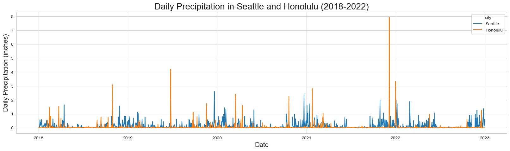
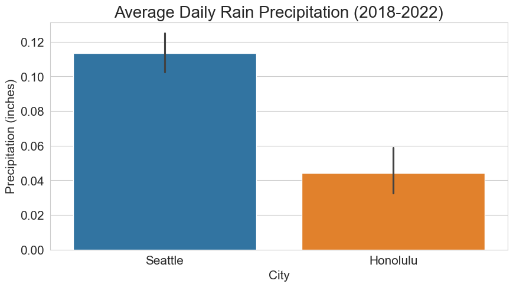
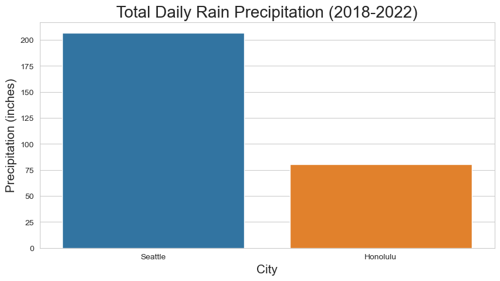
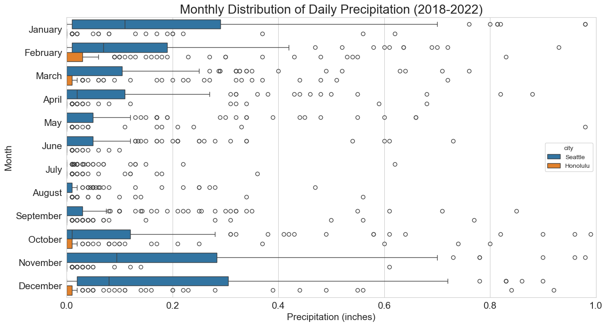
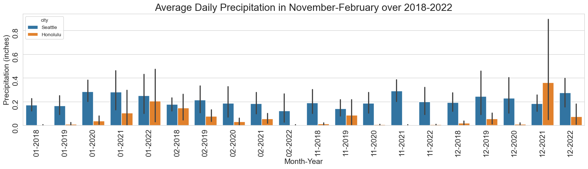

# Seattle and Honolulu Rain Precipitation Report. Does Honolulu get more rain than Seattle?

## Introduction
This report analyzes daily rain precipitation between Seattle and Honolulu in 2018 - 2022. It will compare average monthly rain precipitation between the two cities and determine if Honolulu gets more rain than Seattle. The report would initially compare total daily rain precipitation between the two cities and then analyze how it varies on a monthly basis evaluating seasonal trends, and variability.

## Rain Precipitation Analysis

The analysis focuses on comparing the average monthly rain precipitation (in inches) between Seattle and Honolulu from 2018 to 2022. The data is visualized using a line chart to illustrate the trends over the months.

## Daily Rain Precipitation Analysis

### Rain Precipitation for Seattle and Honolulu (inches)

*Honolulu shows low and consistent rain precipitation throughout the year with occassional spikes, while Seattle exhibits significant seasonal variation with higher precipitation in the winter months.*

### Average Daily Rain Precipitation

*_As we can see from the chart above, Seattle generally receives more rain on average per day compared to Honolulu throughout the year._*

### Total Rain Precipitation (inches) in years 2018-2022

*Seattle receives significantly more total rain precipitation compared to Honolulu over the five-year period from 2018 to 2022.*

## Monthly Rain Precipation Analysis
Evaluating monthly distribution of daily rain precipitation for Seattle and Honolulu to understand seasonal trends and variability.

### Monthly Distribution of Daily Rain Precipitation

*The x-axis is reduced to 0-1 inch to better visualize data*

 Honolulu shows significanlty lower monthly average daily precipitation for every month of the year in comparison to Seattle. Most of the months shows low average daily precipitation, with higher and consistent precipitation in January, June, October, and December. Seattle shows that highest rain precipitation is in the winter months but there are significant variations during those months. 

### November-February Monthly Distribution of Daily Precipitation by Year

Graph shows that there is no significant difference in the monthly variation across years for Seattle, and variations exist are mostly within the month. For Honolulu, we can see that 2021 and 2022 were significantly higher with 2021 December rain precipitation being the only month with higher daily precipitation than Seattle.

## Conclusion
Based on the analysis of daily rain precipitation data from 2018 to 2022, Seattle consistently receives more rain than Honolulu. The average daily precipitation in Seattle is higher than that of Honolulu throughout the year, and the total precipitation over the five-year period also indicates that Seattle experiences significantly more rainfall. We can conclude that it rains more in Seattle than in Honolulu. Similarly , monthly analysis shows that Seattle has higher average daily precipitation for every month of the year compared to Honolulu. Seasonal trends are evident in Seattle with higher precipitation in the winter months. 

## Data Sources, Collection, and Preparation

### Data Sources
The data used in this report is sourced from the NOAA website: 
 https://www.ncei.noaa.gov/cdo-web/search?datasetid=GHCND.
*Note: Honolulu data is from Honolulu Airport station USW00022521 and Seattle data is from station GHCND:US1WAKG0225.*

**Data discrepancy**
- Honolulu - no missing precipitation values.
- Seattle - missed precipitation readings for 190 days. 

**Missing Data Handling**
Seattle dataset missing precipitation values were filled with the average precipitation for that day of the year across 2018-2022.

**Processed Data**
The processed data used in this report can be found in the GitHub repository:
https://github.com/JLichwa80/weather/tree/main/data

